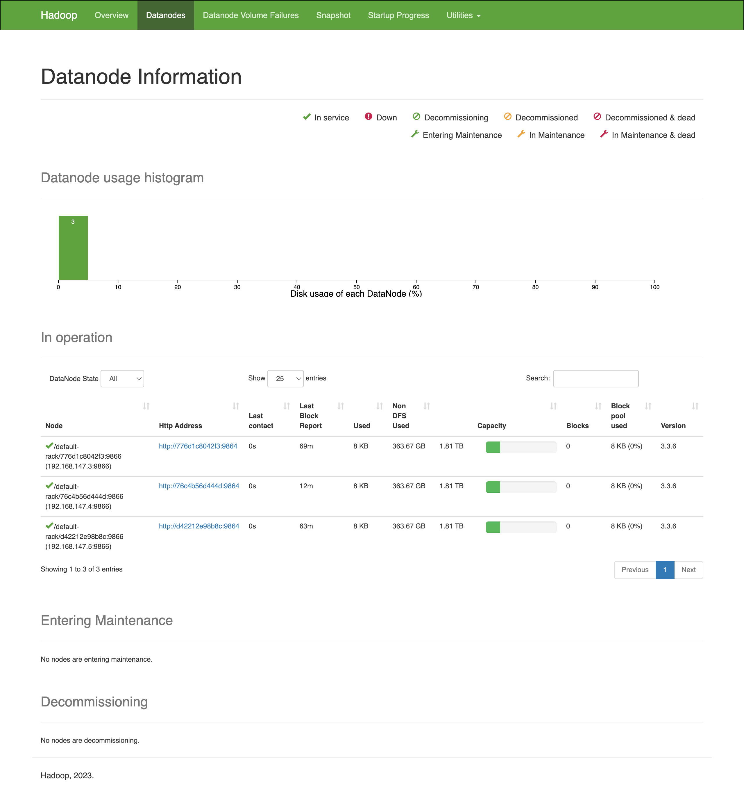
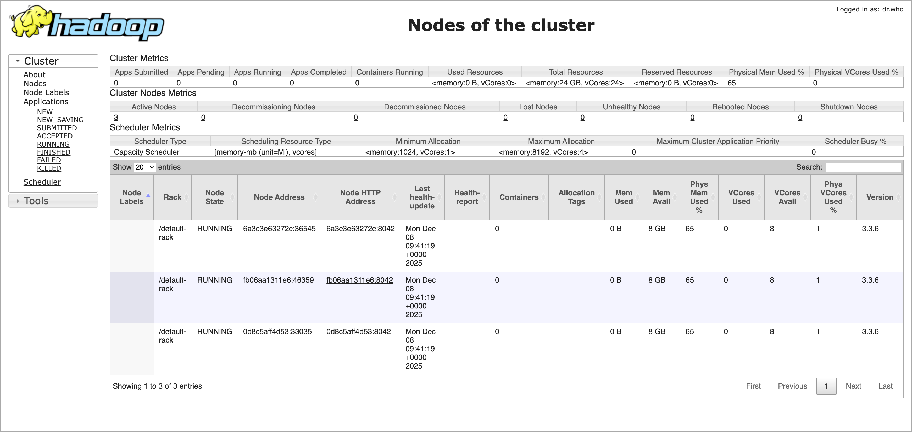

# Hadoop 3-Node Cluster - Docker Implementation

[](https://hadoop.apache.org/)
[](https://docs.docker.com/compose/)
[](https://www.apache.org/licenses/LICENSE-2.0)

> Production-ready Apache Hadoop 3-node distributed cluster dengan Docker Compose, persistent storage, dan fault tolerance.

## 🎯 Overview

Project ini menyediakan setup lengkap untuk menjalankan **Apache Hadoop 3.3.6** distributed cluster dengan:

- **1 NameNode** + **3 DataNodes** (HDFS layer)
- **1 ResourceManager** + **3 NodeManagers** (YARN layer)
- **Replication Factor 3** untuk data redundancy
- **Persistent Storage** dengan Docker volumes
- **Web UI** untuk monitoring dan management

---

## 🏗️ Arsitektur

```
┌─────────────────────────────────────────────────────────┐
│                    HDFS Layer                           │
│  ┌──────────────┐                                       │
│  │  NameNode    │  Metadata Management                  │
│  │  Port: 9870  │  (Web UI)                             │
│  └──────┬───────┘                                       │
│         │                                               │
│    ┌────┴────┬──────────┬──────────┐                    │
│ ┌──▼────┐ ┌──▼─────┐ ┌──▼─────┐                         │
│ │DataN1 │ │DataN2  │ │DataN3  │  Total: ~720GB          │
│ └───────┘ └────────┘ └────────┘                         │
│  Replication Factor: 3 (fault tolerant)                 │
└─────────────────────────────────────────────────────────┘

┌─────────────────────────────────────────────────────────┐
│                    YARN Layer                           │
│  ┌──────────────────┐                                   │
│  │ ResourceManager  │  Resource Scheduling              │
│  │  Port: 8088      │  (Web UI)                         │
│  └────────┬─────────┘                                   │
│    ┌──────┴──────┬────────────┬──────────┐              │
│ ┌──▼────────┐ ┌──▼───────┐ ┌──▼───────┐                 │
│ │NodeMgr1   │ │NodeMgr2  │ │NodeMgr3  │                 │
│ │Containers │ │Containers│ │Containers│                 │
│ └───────────┘ └──────────┘ └──────────┘                 │
└─────────────────────────────────────────────────────────┘
```

---

## ✨ Features

✅ **Easy Setup** - Single command untuk deploy entire cluster
✅ **Persistent Storage** - Data tetap ada setelah container restart
✅ **Fault Tolerant** - 3-node replication untuk data safety
✅ **Web Monitoring** - Built-in web UI untuk NameNode, ResourceManager, DataNode, dan NodeManager
✅ **Individual Node Access** - Monitor setiap DataNode dan NodeManager secara terpisah via Web UI
✅ **Production Ready** - Konfigurasi optimal untuk workload nyata
✅ **Well Documented** - Comprehensive docs dengan troubleshooting guide  

---

## 🚀 Quick Start

### Prerequisites

- Docker & Docker Compose
- Minimal 8GB RAM
- 50GB free disk space

### Installation

**1. Clone repository**
```bash
git clone <repository-url>
cd docker
```

**2. Format NameNode** (first time only)
```bash
docker-compose run --rm namenode hdfs namenode -format -force
```

**3. Start cluster**
```bash
docker-compose up -d
```

**4. Verify cluster**
```bash
# Check all containers running
docker-compose ps

# Check HDFS health
docker-compose exec namenode hdfs dfsadmin -report

# Check YARN nodes
docker-compose exec resourcemanager yarn node -list
```

**5. Configure hostname resolution** (for DataNode Web UI access)

Add to `/etc/hosts`:
```bash
sudo nano /etc/hosts
```

Add these lines:
```
127.0.0.1 datanode1
127.0.0.1 datanode2
127.0.0.1 datanode3
127.0.0.1 nodemanager1
127.0.0.1 nodemanager2
127.0.0.1 nodemanager3
```

**6. Access Web UIs**
- **NameNode UI**: http://localhost:9870
- **ResourceManager UI**: http://localhost:8088
- **DataNode 1 UI**: http://localhost:9864
- **DataNode 2 UI**: http://localhost:9865
- **DataNode 3 UI**: http://localhost:9866
- **NodeManager 1 UI**: http://localhost:8042
- **NodeManager 2 UI**: http://localhost:8043
- **NodeManager 3 UI**: http://localhost:8044

### 📸 Cluster Screenshots

**NameNode Web Interface**



**Cluster Nodes Overview**



---

## 📁 Project Structure

```
.
├── docker-compose.yml      # 8 services orchestration
├── config                  # Hadoop configuration (27 params)
├── .env                    # Environment variables
├── .gitignore              # Git ignore patterns
├── test.sh                 # Health check script
├── .claude/                # Claude AI configuration
├── .playwright-mcp/        # Playwright test screenshots
├── data/                   # Persistent storage (auto-created)
│   ├── namenode/           # HDFS metadata
│   ├── datanode{1,2,3}/    # HDFS data blocks
│   └── yarn/               # YARN state
├── docs/                   # Documentation
│   ├── README.md           # Detailed documentation
│   └── QUICK_REFERENCE.md  # Command cheat sheet
└── images/                 # Screenshots for documentation
    ├── namenode.png        # NameNode Web UI
    └── nodes-of-cluster.png # Cluster nodes overview
```

---

## 💻 Common Operations

### HDFS Operations

```bash
# Create directory
docker-compose exec namenode hdfs dfs -mkdir -p /user/hadoop

# Upload file
docker-compose exec namenode hdfs dfs -put /local/file /user/hadoop/

# List files
docker-compose exec namenode hdfs dfs -ls /user/hadoop/

# Download file
docker-compose exec namenode hdfs dfs -get /user/hadoop/file /local/path

# Delete file
docker-compose exec namenode hdfs dfs -rm /user/hadoop/file
```

### YARN Operations

```bash
# List running applications
docker-compose exec resourcemanager yarn application -list

# Run MapReduce example (Pi estimation)
docker-compose exec resourcemanager hadoop jar \
  $HADOOP_HOME/share/hadoop/mapreduce/hadoop-mapreduce-examples-*.jar \
  pi 2 100
```

### Cluster Management

```bash
# Start cluster
docker-compose up -d

# Stop cluster (data persists)
docker-compose down

# Restart cluster
docker-compose restart

# View logs
docker-compose logs -f namenode
```

---

## 🛠️ Troubleshooting

### NameNode Won't Start

**Symptom**: Container exits with code 1

**Solution**:
```bash
# Format namenode
docker-compose run --rm namenode hdfs namenode -format -force

# Restart
docker-compose up -d namenode
```

### DataNodes Not Connecting

**Symptom**: `hdfs dfsadmin -report` shows 0 live datanodes

**Solution**:
```bash
# Wait 60 seconds for startup
sleep 60

# Check again
docker-compose exec namenode hdfs dfsadmin -report

# If still failing, restart datanodes
docker-compose restart datanode1 datanode2 datanode3
```

### Port Already in Use

**Solution**: Change ports in `docker-compose.yml`
```yaml
namenode:
  ports:
    - "19870:9870"  # Changed from 9870 to 19870
```

**More troubleshooting**: See [docs/README.md](docs/README.md#troubleshooting)

---

## 📚 Documentation

| Document | Description |
|----------|-------------|
| [**Detailed Documentation**](docs/README.md) | Complete guide dengan architecture, konfigurasi, troubleshooting |
| [**Quick Reference**](docs/QUICK_REFERENCE.md) | Command cheat sheet untuk daily operations |

### Key Topics Covered

- ✅ Penjelasan setiap file dan directory
- ✅ 9 troubleshooting scenarios dengan solutions
- ✅ HDFS & YARN operation guides
- ✅ Backup & restore procedures
- ✅ Best practices untuk production
- ✅ Performance tuning tips
- ✅ Security considerations

---

## 🔧 Configuration

### Key Files

**docker-compose.yml** - Service definitions
- 1 NameNode (port 9870)
- 3 DataNodes with hostname and port mapping:
  - `datanode1` (container_name: datanode1, hostname: datanode1, port: 9864)
  - `datanode2` (container_name: datanode2, hostname: datanode2, port: 9865)
  - `datanode3` (container_name: datanode3, hostname: datanode3, port: 9866)
- 1 ResourceManager (port 8088)
- 3 NodeManagers with hostname and port mapping:
  - `nodemanager1` (container_name: nodemanager1, hostname: nodemanager1, port: 8042)
  - `nodemanager2` (container_name: nodemanager2, hostname: nodemanager2, port: 8043)
  - `nodemanager3` (container_name: nodemanager3, hostname: nodemanager3, port: 8044)

**config** - Hadoop parameters
```
HDFS-SITE.XML_dfs.replication=3
HDFS-SITE.XML_dfs.namenode.name.dir=file:///tmp/hadoop-root/dfs/name
HDFS-SITE.XML_dfs.client.use.datanode.hostname=false
HDFS-SITE.XML_dfs.datanode.use.datanode.hostname=false
YARN-SITE.XML_yarn.resourcemanager.hostname=resourcemanager
```

**/etc/hosts** - Hostname resolution (Required for DataNode & NodeManager Web UI)
```
127.0.0.1 datanode1
127.0.0.1 datanode2
127.0.0.1 datanode3
127.0.0.1 nodemanager1
127.0.0.1 nodemanager2
127.0.0.1 nodemanager3
```

**.env** - Environment variables
```bash
HADOOP_HOME=/opt/hadoop
COMPOSE_PROJECT_NAME=hadoop
```

---

## 📊 Monitoring

### Web UIs

**NameNode** - http://localhost:9870
- HDFS overview
- DataNode status
- File browser
- Logs

**DataNode Web UIs** (Individual monitoring)
- **DataNode 1** - http://localhost:9864
  - Block information
  - Volume status
  - Storage metrics
- **DataNode 2** - http://localhost:9865
  - Block information
  - Volume status
  - Storage metrics
- **DataNode 3** - http://localhost:9866
  - Block information
  - Volume status
  - Storage metrics

> **Note**: DataNode Web UIs require hostname configuration in `/etc/hosts` as described in Quick Start section.

**ResourceManager** - http://localhost:8088
- Cluster metrics
- Running applications
- Node status
- Scheduler info

**NodeManager Web UIs** (YARN resource monitoring)
- **NodeManager 1** - http://localhost:8042
  - Container information
  - Resource allocation
  - Application logs
- **NodeManager 2** - http://localhost:8043
  - Container information
  - Resource allocation
  - Application logs
- **NodeManager 3** - http://localhost:8044
  - Container information
  - Resource allocation
  - Application logs

> **Note**: NodeManager Web UIs require hostname configuration in `/etc/hosts` as described in Quick Start section.

### CLI Monitoring

```bash
# HDFS status
docker-compose exec namenode hdfs dfsadmin -report

# YARN nodes
docker-compose exec resourcemanager yarn node -list

# Check specific file distribution across DataNodes
docker-compose exec namenode hdfs fsck /path/to/file -files -blocks -locations

# Disk usage
docker-compose exec namenode hdfs dfs -du -h /

# Running apps
docker-compose exec resourcemanager yarn application -list

# Individual DataNode logs
docker logs datanode1
docker logs datanode2
docker logs datanode3

# Individual NodeManager logs
docker logs nodemanager1
docker logs nodemanager2
docker logs nodemanager3
```

---

## 💾 Backup & Recovery

### Backup NameNode Metadata (Critical!)

```bash
# Daily backup
tar -czf namenode-backup-$(date +%Y%m%d).tar.gz data/namenode/
```

### Full Cluster Backup

```bash
# Weekly backup
tar -czf hadoop-full-backup-$(date +%Y%m%d).tar.gz data/
```

### Restore

```bash
# Extract backup
tar -xzf hadoop-backup-20251201.tar.gz

# Restart cluster
docker-compose restart
```

---

## ⚡ Performance Tips

### Resource Limits

Add to `docker-compose.yml`:
```yaml
namenode:
  deploy:
    resources:
      limits:
        cpus: '2'
        memory: 4G
```

### HDFS Block Size

Optimize for large files:
```
HDFS-SITE.XML_dfs.blocksize=134217728  # 128MB
```

### YARN Memory

Configure NodeManager memory:
```
YARN-SITE.XML_yarn.nodemanager.resource.memory-mb=8192
YARN-SITE.XML_yarn.scheduler.maximum-allocation-mb=4096
```

---

## 🔐 Security Considerations

**For Production**:

1. ✅ Enable Kerberos authentication
2. ✅ Enable HDFS encryption at rest
3. ✅ Setup SSL/TLS for Web UIs
4. ✅ Configure firewall rules
5. ✅ Regular security updates
6. ✅ Implement access control lists (ACLs)
7. ✅ Monitor audit logs

---

## 🧪 Testing

### Run Health Check Script

```bash
docker-compose exec resourcemanager bash /opt/test.sh
```

Tests performed:
- ✅ HDFS cluster report
- ✅ YARN node status
- ✅ Create HDFS directory
- ✅ Upload file with replication
- ✅ Verify replication factor
- ✅ Run MapReduce Pi estimation

---

## 🤝 Contributing

Contributions welcome! Please:

1. Fork the repository
2. Create feature branch (`git checkout -b feature/amazing-feature`)
3. Commit changes (`git commit -m 'Add amazing feature'`)
4. Push to branch (`git push origin feature/amazing-feature`)
5. Open Pull Request

---

## 📝 License

This project configuration is based on Apache Hadoop.

- **Apache Hadoop**: [Apache License 2.0](https://www.apache.org/licenses/LICENSE-2.0)
- **This Configuration**: Free to use and modify

---

## 🔗 Resources

### Official Documentation
- [Hadoop Documentation](https://hadoop.apache.org/docs/r3.3.6/)
- [HDFS Architecture](https://hadoop.apache.org/docs/r3.3.6/hadoop-project-dist/hadoop-hdfs/HdfsDesign.html)
- [YARN Architecture](https://hadoop.apache.org/docs/r3.3.6/hadoop-yarn/hadoop-yarn-site/YARN.html)
- [MapReduce Tutorial](https://hadoop.apache.org/docs/r3.3.6/hadoop-mapreduce-client/hadoop-mapreduce-client-core/MapReduceTutorial.html)

### Docker
- [Apache Hadoop Docker Image](https://hub.docker.com/r/apache/hadoop)
- [Docker Compose Documentation](https://docs.docker.com/compose/)

### Community
- [Apache Hadoop Wiki](https://cwiki.apache.org/confluence/display/HADOOP)
- [Stack Overflow - hadoop tag](https://stackoverflow.com/questions/tagged/hadoop)

---

## 📧 Support

Untuk pertanyaan, issues, atau contributions:

- 🐛 [Report Issues](../../issues)
- 💡 [Feature Requests](../../issues)
- 📖 [Documentation](docs/README.md)
- ⚡ [Quick Reference](docs/QUICK_REFERENCE.md)

---

## 🎓 Learning Resources

**Recommended for Beginners**:
1. Start dengan [Quick Start](#-quick-start)
2. Explore Web UIs (NameNode & ResourceManager)
3. Practice HDFS operations dari [Common Operations](#-common-operations)
4. Run MapReduce examples
5. Read [Detailed Documentation](docs/README.md)

**For Advanced Users**:
- Performance tuning guidelines
- Security hardening procedures
- Custom configuration optimization
- Integration dengan ecosystem tools (Hive, Spark, HBase)

---

## 🌟 Star History

If you find this project useful, please consider giving it a ⭐!

---

## 📅 Changelog

**v1.1.0** (2025-12-08)
- ✅ Added DataNode hostname configuration (datanode1, datanode2, datanode3)
- ✅ Enabled individual DataNode Web UI access
- ✅ Configured port mapping for DataNode monitoring (9864, 9865, 9866)
- ✅ Added NodeManager hostname configuration (nodemanager1, nodemanager2, nodemanager3)
- ✅ Enabled individual NodeManager Web UI access
- ✅ Configured port mapping for NodeManager monitoring (8042, 8043, 8044)
- ✅ Added `/etc/hosts` configuration guide for both HDFS and YARN layers
- ✅ Enhanced monitoring capabilities with per-node metrics for DataNode and NodeManager

**v1.0.0** (2025-12-01)
- ✅ Initial 3-node cluster setup
- ✅ Persistent storage implementation
- ✅ Replication factor 3 configuration
- ✅ Docker Compose orchestration
- ✅ Comprehensive documentation
- ✅ Health check scripts
- ✅ Troubleshooting guides

---

<div align="center">

**Built with ❤️ for the Hadoop Community**

[Documentation](docs/README.md) • [Quick Reference](docs/QUICK_REFERENCE.md) • [Report Bug](../../issues) • [Request Feature](../../issues)

</div>
